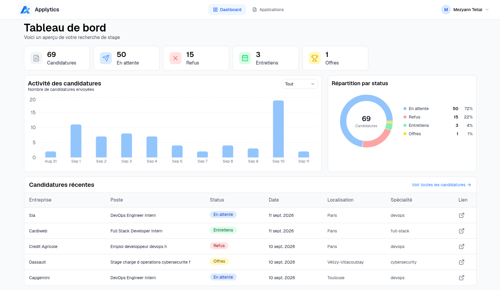
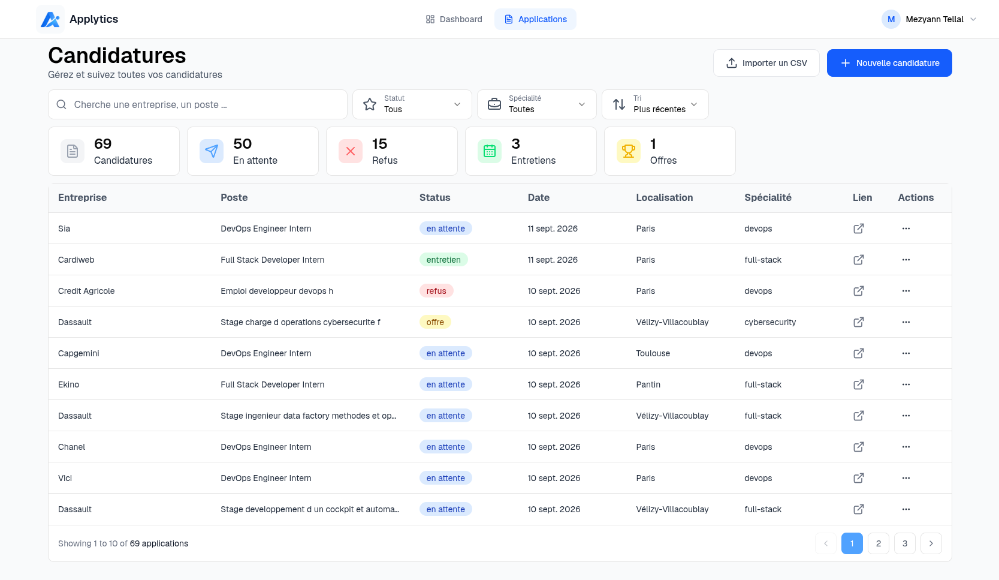

# Applytics

A web app to organize your internship search, built with React and Supabase.

I built Applytics because I was tired of tracking my internship applications in Google Sheets. It was also an opportunity to revisit React and strengthen my frontend skills by building something I would actually use.

**[Visit Applytics](https://applytics-v2.vercel.app/)**





## Features

- Manage internship applications with statuses, role details, links, and notes.
- Search, filter, and sort applications across tech fields.
- Follow your progress with dashboard statistics and charts.
- Import CSV files with validation and a preview.
- Sign in with Google and delete your account and associated data.
- Responsive interface available in English and French.

## Tech stack

- **Frontend:** React, TypeScript, Vite, React Router.
- **UI:** Tailwind CSS, shadcn/ui, Base UI, Lucide, Recharts.
- **Backend:** Supabase PostgreSQL, Auth, and Edge Functions.
- **Utilities:** Papa Parse, date-fns, i18next.
- **Testing and tooling:** Vitest, React Testing Library, ESLint, Prettier.

Code is organized by feature, with components, hooks, services, and validation utilities. Supabase handles authentication and data storage; RLS isolates each user's applications, and an Edge Function handles account deletion.

## What I revisited

React components, hooks, forms, and routing; TypeScript models and runtime validation; testing utilities and user interactions; and connecting a frontend to authentication and a database. This project also gave me practice organizing code and handling loading and error states.

## Getting started

Requires **Node.js 22.12+**, npm, a Supabase project, and a Google Cloud project for Google sign-in. The frontend runs locally with a hosted Supabase backend.

### Installation

```bash
git clone https://github.com/mtellal/applytics_v2.git
cd applytics_v2
npm ci
cp .env.example .env
```

Fill in `.env`:

```dotenv
VITE_SUPABASE_URL=https://YOUR_PROJECT_REF.supabase.co
VITE_SUPABASE_ANON_KEY=YOUR_SUPABASE_PUBLISHABLE_KEY
VITE_ENV=prod
```

Use a publishable key or legacy anon key, never a secret or service-role key. Keep `VITE_ENV=prod` even locally to use Supabase data; other values enable mocks for some services only.

### Supabase and Google OAuth

1. **Database:** run [docs/supabase-setup.sql](docs/supabase-setup.sql) in a new project's SQL Editor. It creates the `applications` table, ownership policies (RLS), and cascading deletion of applications when an account is deleted. This starter schema is based on the code, not an export of the live database.
2. **Google Cloud:** configure the consent screen and a Web application OAuth client. Add `http://localhost:5173` as an authorized origin and `https://YOUR_PROJECT_REF.supabase.co/auth/v1/callback` as a redirect URI. Add your account as a test user if the OAuth app is in testing mode.
3. **Supabase Auth:** enable Google with your client ID and secret. Set the Site URL to `http://localhost:5173` and allow `http://localhost:5173/dashboard` as a redirect URL. See the [Google OAuth guide](https://supabase.com/docs/guides/auth/social-login/auth-google) for details.
4. **Account deletion:** deploy the included Edge Function:

```bash
npx supabase login
npx supabase functions deploy delete-account --project-ref YOUR_PROJECT_REF
```

Then start the app:

```bash
npm run dev
```

Open the URL printed by Vite. If the port changes, update your OAuth configuration to match.

## Configure application fields

Edit `application-fields.json` at the project root to set the available fields. Use a non-empty list of unique strings; `all` is reserved for filters. The first value is the default for new applications.

The TypeScript array and union type are generated automatically before `npm run dev`, `npm run build`, `npm test`, and `npm run lint`. Restart the dev server after editing the JSON, or run `npm run generate:fields` to regenerate manually. Do not edit `src/generated/applicationFields.ts` directly.

Forms, filters, and CSV validation use this list. CSV values must match exactly. Keep values already used by existing applications unless you migrate those records first.

For an existing database created with the previous setup script, run [docs/remove-field-constraint.sql](docs/remove-field-constraint.sql) once in Supabase to remove the old fixed list constraint. The updated setup script already allows custom fields.

## Useful commands

| Command             | Purpose                         |
| ------------------- | ------------------------------- |
| `npm test`          | Run tests in watch mode         |
| `npm test -- --run` | Run tests once                  |
| `npm run lint`      | Check code with ESLint          |
| `npm run build`     | Type-check and build to `dist/` |
| `npm run preview`   | Preview the production build    |

Tests cover CSV parsing, validation, and the import dialog.

## Deployment

The frontend is hosted on Vercel, with Supabase providing the backend. For your own deployment, use the Vite preset, build with `npm run build`, publish `dist/`, and set the same environment variables. The included `vercel.json` handles client-side routing.

Update Supabase's Site URL to your domain, allow its `/dashboard` redirect URL, and add the production origin in Google Cloud.

## License

[MIT](LICENSE)
